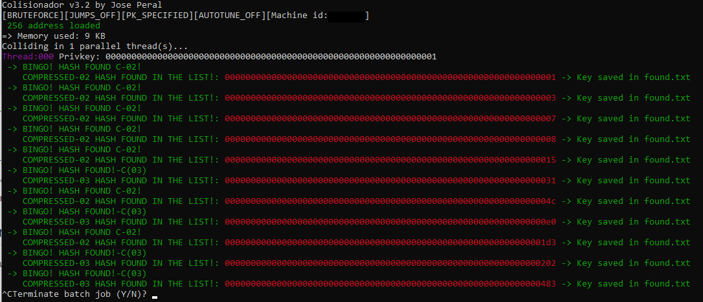
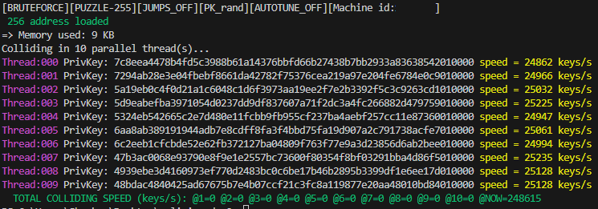
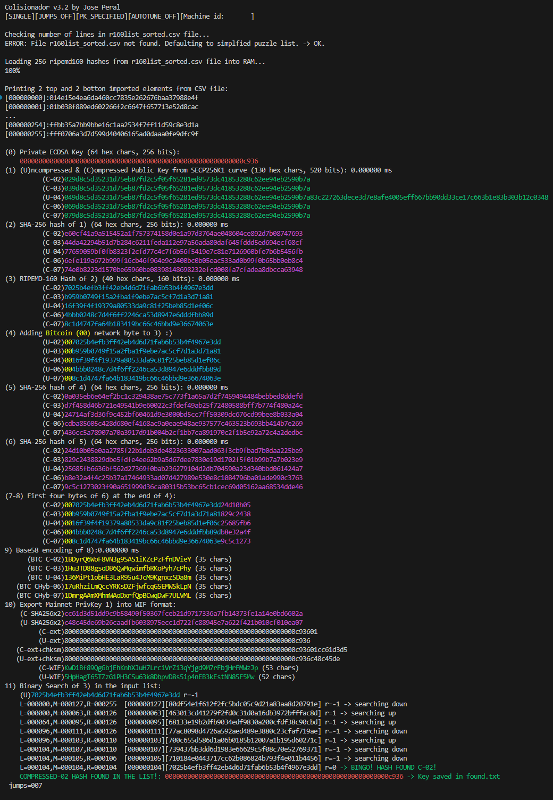

# Colisionador, by Jose Peral

## What is Colisionador?
Colisionador is a C++ program that searches for the private key of a BTC address by brute force. It uses the ripemd160 hash of the public key to search for the private key that generates the same hash. The program uses the OpenSSL library to generate the public key from the private key, and the ripemd160 hash of the public key. The search is done by incrementing the private key in a loop, generating the public key and the ripemd160 hash, and comparing it with the target address. The program uses all the available CPU threads to search for the private key, and it is optimized to use the maximum CPU resources available. The program is designed to be run in a Unix environment, but it can also be run in Windows and Xeon Phi coprocessor. It runs in solo mode, and it does not require any external server to coordinate the search. It can be considered like a lottery bitcoin wallet cracker.

## What is the BTC puzzle?
It is an eastern egg inside BTC blockchain, someone sent arround 65.8 BTC to 256 addresses (puzzle pieces) over the time.
This is the transaction: https://mempool.space/address/1Czoy8xtddvcGrEhUUCZDQ9QqdRfKh697F
This is the thread in Bitcointalk: https://bitcointalk.org/index.php?topic=1306983.0
This is another project that is trying to solve the puzzle they use a server to coordinate the clients: https://lbc.cryptoguru.org/trophies

Each of the destination addresses have a balance that matches the puzzle pieces sequence order.

* Puzzle #1 [1BgGZ9tcN4rm9KBzDn7KprQz87SZ26SAMH](https://mempool.space/address/1BgGZ9tcN4rm9KBzDn7KprQz87SZ26SAMH) - Balance = 0.1 BTC - private key lenght 1 bit.

* Puzzle #2 [1CUNEBjYrCn2y1SdiUMohaKUi4wpP326Lb](https://mempool.space/address/1CUNEBjYrCn2y1SdiUMohaKUi4wpP326Lb) - Balance = 0.2 BTC - private key lenght 2 bit.

* Puzzle #3 [19ZewH8Kk1PDbSNdJ97FP4EiCjTRaZMZQA](https://mempool.space/address/19ZewH8Kk1PDbSNdJ97FP4EiCjTRaZMZQA)- Balance = 0.4 BTC - private key lenght 3 bit...

* Puzzle #66 [13zb1hQbWVsc2S7ZTZnP2G4undNNpdh5so](https://mempool.space/address/13zb1hQbWVsc2S7ZTZnP2G4undNNpdh5so) - Balance = 6.6 BTC - private key lenght 66 bit...

The particularity of this puzzle is the difficulty to find the private key by brute force, doubles with each piece of the puzzle, as the private key increases one bit in lenght (doubling the difficulty).

Currently the easiest puzzle piece with balance is puzzle-66 piece. This is the address, Balance is 6.60 BTC: 
https://mempool.space/address/13zb1hQbWVsc2S7ZTZnP2G4undNNpdh5so

This way, puzzle-66 will have a private key that have bit 66 to 1, and the low significant bits unknown that have to be cracked by brute force.

File puzzle_r160list_sorted contains all the addresses of the puzzle (even the ones with 0 Balance currently).

## Setup instructions:
This are 64 bits binaries for Windows X86_64, and Unix X86_64, Unix ARMv7l and native for Kinghts Corner x100 Xeon Phi Coprocesor.

You can run the Linux binaries in a windows host machine enabling WSL and Debian subsystem.

1. Clone Colisionador_releases repo. In case of Xeon Phi X100 CPU, clone in the host system.
```
    $git clone https://www.github.com/japeral/colisionador_releases colisionador
```
2 (Optional) Download the latest list of BTC addresses with balance at begining of May 2023, and rename it to 'r160list_sorted.csv'
[Download](https://drive.google.com/file/d/1ppTbtCUtVbvwgViI1CVzXHKFTteLEMej/view)
```
    $./download_latest_list.sh
    $mv 'uc...' r160list_sorted.csv    
```
* If you want to make your own file, it has to have the all entries sorted by the ripemd160, or the binary search algorithm will not work well.

3a. In case of x100 Xeon Phi Coprocesor: open an ssh session to the card and:
```
	copy colisionador_releases folder from host to /root/ folder in Xeon Phi file system.
	in /root/colisionador_releases/ $ chmod 777 *.sh
	in /root/colisionador_releases/ $ chmod 777 colisionador_*
	copy libiomp5.so from colisionador_releases to [root@mic0 ~]#/usr/lib64/libiomp5.so
```

3b. I case of Windows or Linux, access the folder:
```
    $cd colisionador
```

4. Test

Linux
```
./test.sh
```
Windows
```
test.bat
```
Xeon Phi:
```
[root@mic0 ~]# ./test.sh
```

* Test uses puzzle_r160list_sorted.csv addresses, and starts searching in the specified private key 1 with only one thread.
* If everything is all right you should be finding puzzle #1 piece stright away.
* Private keys will be stored in 'found.txt' file.
* Do you see? This really works.



## Run instructions:
To start colliding for puzzle 66 private key execute:

Linux
```
$ ./start.sh
```
* If permission errors, run $sudo chmod 777 colisionador*

Windows
```
start.bat
```
Xeon Phi
```
[root@mic0 ~]# cd /root/colisionador_releases
[root@mic0 ~]# ./start.sh
```

* If interested to search another piece, edit the -puzzle parameter inside the .sh/.bat file.


## Binary additional parameters
For the complete list just use the --help parameter.
```
$./colisionador_x86_64 --help
```
-threads xx parameter: where xx is the number of threads to use, if not specified, uses all the available.
```
-threads xx
```
-puzzle parameter: specifies which puzzle bit to collide, lower bits are randomized. If specified to 255, search will target the entire 256bit seach space.
```
-puzzle 255
```


-rand_pk parameter: jumps to anothre random pk address after PrivKey byte[29] overflow, jumps are OFF by default.
```
-rand_pk
```
-single parameter: Searches only for one private key, and shows the calculation and searching steps.
```
-single
```
-start_pk_bin parameter: Starts searching at the specified private key
```
.\colisionador_x86_64.exe -start_pk_bin 000000000000000000000000000000000000000000000000000000000000c936
```


## BINGO! (In the rare case of finding some private key with balance):
* Import the WIF into a fully synced Bitcoin Core node. 
* If not sure how to do that, contact me by email (japeralsoler@gmail.com) attaching the 'found.txt' file.
* Transfer the balance to another BTC wallet where you control the private keys.
* Please consider donating something to me, thanks: bc1q7gn92ny4c7gd309phkmd24naw8rq2fend44mzj

## Benchmark
|                           Hardware                            |  OS  | Threads| Search speed keys/s |
| :-------------------------------------------------------------| :--: |:-----: | :-----------------: |
| Raspberry Pi 4B ARMv7 @ 2000Mhz (4 cores)                     | Unix |    4   |         32K         |
| AMD Athlon(tm) X4 950 Quad Core (4 cores - 4 logical)         | Win10|    4   |         81K         |
| Intel® Xeon® E5-4627 v4 @ 2.60GHz, (10 cores - 10 logical)    | Unix |   10   |        249K         |
| Intel® Core™ i7-10850H @ 2.70GHz, (6 cores - 12 logical)      | Unix |   12   |        220K         |
| AMD Ryzen 7 7730U @ 2-3 GHz, (8 cores - 16 logical)           | Win10|   16   |        290K         | 
| Intel® Core™ i9-9900K @ 3.60GHz, (8 cores - 16 logical)       | Win10|   16   |        378K         |
| Intel® Core™ i9-10900K @ 3.70GHz, (10 cores - 20 logical)     | Win10|   20   |        489K         | 
| Intel® Xeon Phi 31S1P @ 1.10GHz, (57 cores - 288 logical)     | Unix |  288   | 105K(30M)/108(256)  | 
| Intel® Xeon Phi 31S1P @ 1.10GHz, (57 cores - 288 logical)     | Unix |  128   |  78K(30M)/80K(256)  | 
| Intel® Xeon Phi 31S1P @ 1.10GHz, (57 cores - 288 logical)     | Unix |   57   |  79K(30M)/82K(256)  | 
| Intel® Xeon Phi 31S1P @ 1.10GHz, (57 cores - 288 logical)     | Unix |   29   |  40K(30M)/42K(256)  | 

## The Probability Maths...
The mean time to find the private that opens Puzzle-66 by burteforce, with one CPU thread on an average personal computer @22K keys/s per thread is:

Mean time = (Number of total combinations) / (search speed) = (2^65) / (22,000) ≈ 1.6779404 × 10^15 seconds

To days: 1.6779404 × 10^15 s / (60 s * 60 min * 24 h) ≈ 1.9430023 × 10^10 days

To Years: 1.9430023 × 10^10 days / 365 days ≈ 5.324932 × 10^7 years

That means: 53,249,320,000 years

So, consider executing this binary some kind of lottery...

## New features, improvements and Contact
* If interested to add new features, please contact me by email (japeralsoler@gmail.com)
* I am currently working to port the code to support GPU acceleration.

Good luck!

----------------------------------------------------------------
BTC Donations: [bc1qmh9uq39gtmvymsz8awfn2dw23scvw0l8segzf0](https://mempool.space/address/bc1qmh9uq39gtmvymsz8awfn2dw23scvw0l8segzf0)
